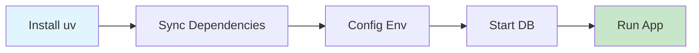

# Quick Start Guide

## 5-Minute Setup

### 1. Install Dependencies



```bash
# Install uv (if not already installed)
curl -LsSf https://astral.sh/uv/install.sh | sh

# Install project dependencies
uv sync --all-extras
```

### 2. Configure Environment

```bash
# Copy environment template
cp .env.example .env

# Edit .env with your Google Cloud Project ID
# GOOGLE_CLOUD_PROJECT=your-project-id
```

### 3. Run Tests

```bash
# Run all tests
uv run pytest

# Or use Makefile
make test
```

### 4. Start Development Server

```bash
# Start FastAPI server
make dev

# Or manually
uv run uvicorn src.api.main:app --reload
```

### 5. Test API

```bash
# Health check
curl http://localhost:8000/health

# Generate screenplay
curl -X POST http://localhost:8000/api/screenplay/generate \
  -H "Content-Type: application/json" \
  -d '{"concept": "A detective who can see the future"}'
```

## Common Commands

```bash
# Development
make dev          # Start dev server
make test         # Run tests
make lint         # Check code quality
make format       # Format code

# Docker
make docker-up    # Start all services
make docker-down  # Stop services
make docker-logs  # View logs

# Testing
make test-unit    # Unit tests only
make test-int     # Integration tests only
make test-cov     # With coverage report

# Cleanup
make clean        # Remove cache files
```

## Project Structure

```
src/
├── agents/              # ADK agents
│   └── screenplay_agent.py
├── api/                 # FastAPI backend
│   ├── main.py          # API routes
│   ├── models.py        # Pydantic schemas
│   └── repository.py    # Repository pattern
└── tools/               # Custom tools

tests/
├── unit/                # Fast, isolated tests
├── integration/         # Component tests
└── e2e/                 # Full workflow tests
```

## Next Steps

1. Read **[DEVELOPMENT.md](docs/DEVELOPMENT.md)** for detailed setup
2. Check **[TESTING.md](docs/TESTING.md)** for testing strategies
3. Review **[EXAMPLES.md](docs/EXAMPLES.md)** for working code examples

## Troubleshooting

### Port Already in Use

```bash
lsof -i :8000
kill -9 <PID>
```

### Dependencies Not Found

```bash
rm -rf .venv
uv sync --all-extras
```

### Pre-commit Issues

```bash
uv run pre-commit clean
uv run pre-commit install
```

## Development Workflow

1. Create feature branch
2. Write code + tests
3. Run `make lint` and `make test`
4. Commit (pre-commit hooks run automatically)
5. Push and create PR

## Testing Your Changes

```bash
# Check everything works
make lint          # Passes linting
make typecheck     # No type errors
make test          # All tests pass
make docker-build  # Docker builds successfully
```

## Getting Help

- Check documentation in `docs/`
- Review examples in `docs/EXAMPLES.md`
- Run `make help` for available commands
