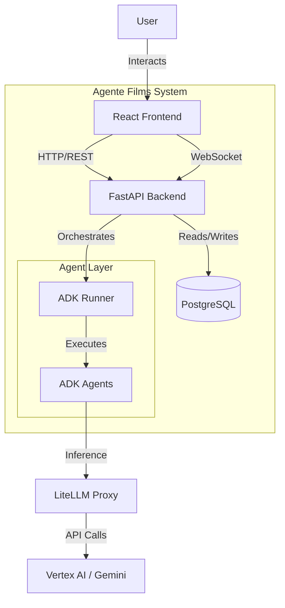
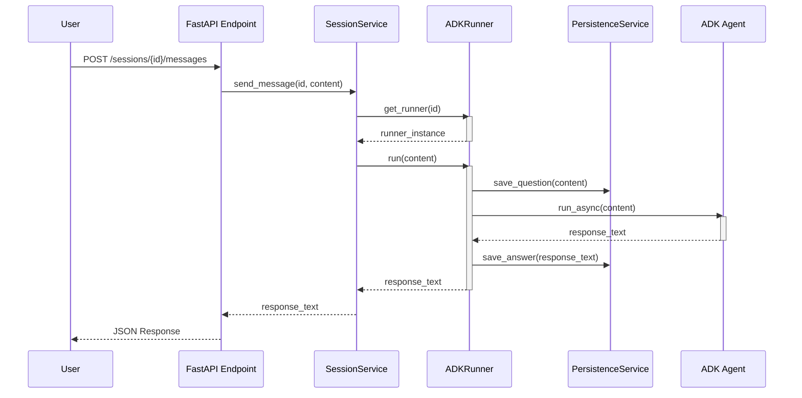
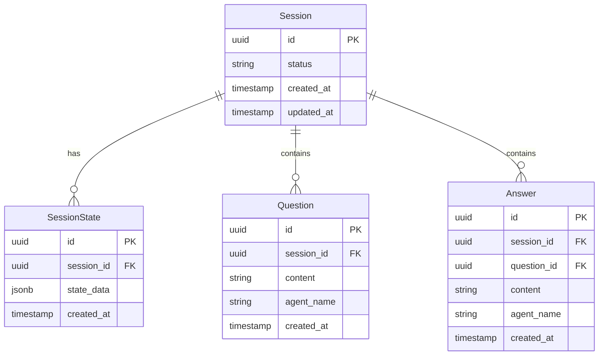

# System Architecture

## Overview

Agente Films is a multi-agent filmmaking system designed to automate the creation of film pitch documents. It leverages Google's Agent Development Kit (ADK) for agent orchestration, FastAPI for the backend API, and a React frontend for user interaction.

## System Context

The following diagram illustrates the high-level system context and interactions between components.

## Component Architecture

### Backend (FastAPI)

The backend follows a clean architecture pattern with distinct layers:

1.  **API Layer (`app/api`)**: Handles HTTP requests, validation (Pydantic), and routing.
2.  **Service Layer (`app/services`)**: Implements business logic and orchestrates components.
3.  **Core Layer (`app/core`)**: Contains the ADK Runner and Session Manager.
4.  **Data Layer (`app/db`)**: Manages database interactions via SQLAlchemy repositories.

### Agent Execution Flow

When a user sends a message, the following sequence occurs:

## Data Model

The database schema is designed to support long-running sessions and persistent agent state.

## Key Components

### Session Manager
Manages the lifecycle of ADK sessions, ensuring they are cached in memory for performance while persisting state to the database for durability.

### ADK Runner
Wraps the Google ADK `Runner` class. It intercepts messages to provide automatic persistence of the conversation history (Questions & Answers) and synchronizes the agent's internal state with the `SessionState` table.

### Persistence Service
Abstracts all database operations related to session history and state, providing a clean interface for the Runner to save data without direct dependency on SQLAlchemy models.

## Components

### 1. ADK Agents Layer

**Purpose**: Specialized agents for filmmaking tasks

**Components**:
- `ScreenplayAgent`: Creates screenplay outlines
- `CharacterAgent`: Develops characters
- `WorkflowAgent`: Orchestrates multi-agent workflows

**Key Features**:
- Model-agnostic (configurable LLM backend)
- Session state management
- Tool integration
- Agent composition (Sequential, Loop, Parallel)

### 2. FastAPI Backend

**Purpose**: HTTP API for agent interaction

**Layers**:

#### a. Routes Layer (`src/api/main.py`)
- HTTP endpoint definitions
- Request/response handling
- Error handling
- CORS configuration

#### b. Repository Layer (`src/api/repository.py`)
- Abstract data access
- Agent lifecycle management
- Caching strategies
- Model selection

#### c. Models Layer (`src/api/models.py`)
- Pydantic schemas
- Request validation
- Response serialization
- Type safety

**Pattern**: Repository Pattern
- Decouples business logic from data access
- Easy to test with mocks
- Swappable implementations

### 3. LiteLLM Proxy

**Purpose**: Unified interface for multiple LLM providers

**Features**:
- Model abstraction
- Load balancing
- Rate limiting
- Cost tracking
- Observability (Langfuse integration)

### 4. Frontend (React)

**Purpose**: User interface for agent interaction

**Components**:
- `ScreenplayGenerator`: Main form component
- `useScreenplay`: Custom hook for API calls
- Type-safe API clients

## Data Flow

### Screenplay Generation Flow

1.  **User Input**: Frontend submits concept
2.  **API Validation**: Pydantic validates request
3.  **Repository**: Selects/creates agent
4.  **Agent Execution**: ADK agent processes request
5.  **LLM Call**: Via LiteLLM proxy to provider
6.  **Response Processing**: Agent structures output
7.  **API Response**: Returns to frontend

### Multi-Agent Workflow

1.  **Workflow Definition**: SequentialAgent with sub-agents
2.  **Sequential Execution**: Each agent runs in order
3.  **State Sharing**: Via session state dictionary
4.  **Tool Calls**: Agents use tools to save data
5.  **Final Output**: Aggregated results

## Design Patterns

### 1. Repository Pattern
**Problem**: Tight coupling between API and data source
**Solution**: Abstract interface for data access
**Benefits**: Easy to test, swappable implementations

### 2. Dependency Injection
**Problem**: Hard-coded dependencies
**Solution**: FastAPI's Depends()
**Benefits**: Testable, flexible configuration

### 3. Strategy Pattern
**Problem**: Multiple algorithm variants
**Solution**: Agent composition (Sequential, Loop, Parallel)
**Benefits**: Flexible workflows, reusable agents

### 4. Factory Pattern
**Problem**: Complex object creation
**Solution**: Repository creates/caches agents
**Benefits**: Centralized agent management, efficient resource usage

## Security

### API Security
- CORS configuration
- Request validation
- Rate limiting (via LiteLLM)

### Environment Variables
- Secrets in .env (never committed)
- Example file (.env.example) for reference
- Docker secrets support

### Docker Security
- Non-root user
- Multi-stage builds
- Minimal base images
- Health checks

## Performance

### Optimization Strategies
1.  **Agent Caching**: Repository caches agent instances
2.  **Async/Await**: Non-blocking I/O throughout
3.  **Connection Pooling**: LiteLLM handles connections
4.  **Docker Multi-stage**: Smaller images, faster deploys

### Monitoring
- **Health Checks**: `/health` endpoint
- **Logging**: Structured logging throughout
- **Observability**: Langfuse for LLM calls
- **Metrics**: Prometheus support (via LiteLLM)

## Scalability

### Horizontal Scaling
- Docker Compose scaling
- Kubernetes (see KUBERNETES_ARCHITECTURE.md)

### Load Balancing
- LiteLLM handles LLM provider balancing
- Reverse proxy for API instances

### State Management
- Session state per request
- Stateless API design
- Database for persistence

## Future Enhancements

### Short Term
- [ ] Database persistence
- [ ] User authentication
- [ ] Rate limiting per user
- [ ] Caching layer (Redis)

### Medium Term
- [ ] Streaming responses
- [ ] WebSocket support
- [ ] Agent marketplace
- [ ] Version control for scripts

### Long Term
- [ ] Collaborative editing
- [ ] Real-time agent monitoring
- [ ] Custom agent training
- [ ] Integration with production tools
