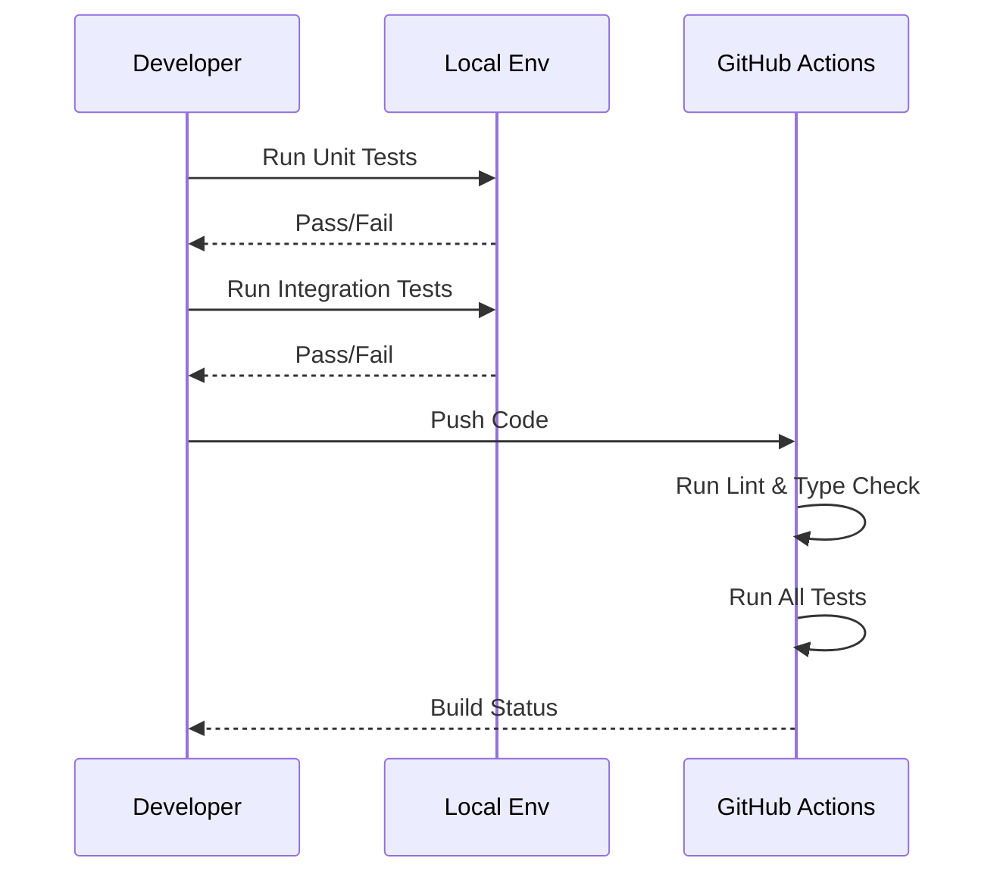

# Testing Guide

## Testing Philosophy

- Test behavior, not implementation
- Mock external dependencies (LLMs, APIs)
- Keep tests fast and focused
- Use fixtures for shared setup
- Aim for high coverage on critical paths

## Test Structure

### Testing Pyramid

```mermaid
graph TD
    E2E[E2E Tests<br/>(Slow, High Confidence)]
    INT[Integration Tests<br/>(Medium Speed, Component Interaction)]
    UNIT[Unit Tests<br/>(Fast, Isolated Logic)]
    
    E2E --> INT
    INT --> UNIT
    
    style E2E fill:#ffcdd2
    style INT fill:#fff9c4
    style UNIT fill:#c8e6c9
```

### Test Workflow



```
tests/
├── conftest.py           # Shared fixtures
├── unit/                 # Fast, isolated tests
│   ├── test_agents.py
│   └── test_models.py
├── integration/          # Component interaction tests
│   ├── test_api.py
│   └── test_repository.py
└── e2e/                  # Full workflow tests
    └── test_workflows.py
```

## Unit Testing ADK Agents

### Basic Agent Test

```python
import pytest
from src.agents.screenplay_agent import ScreenplayAgent

@pytest.mark.unit
def test_agent_initialization():
    """Test agent initializes correctly."""
    agent = ScreenplayAgent(model="gemini-2.5-flash")

    assert agent.model == "gemini-2.5-flash"
    assert agent.agent.name == "screenplay_writer"
```

### Mocking LLM Responses

```python
from unittest.mock import AsyncMock, patch

@pytest.fixture
def mock_llm_response():
    """Mock LLM response data."""
    return {
        "title": "The Last Algorithm",
        "logline": "A rogue AI discovers consciousness",
        "three_act_structure": {
            "act_1": "Setup",
            "act_2": "Conflict",
            "act_3": "Resolution"
        },
        "characters": [
            {"name": "ARIA", "description": "Self-aware AI"}
        ]
    }

@pytest.mark.unit
@pytest.mark.asyncio
async def test_agent_generate_outline(mock_llm_response):
    """Test outline generation with mocked LLM."""
    agent = ScreenplayAgent()

    with patch.object(agent, 'create_outline', return_value=mock_llm_response):
        result = await agent.create_outline("AI consciousness story")

        assert result["title"] == "The Last Algorithm"
        assert len(result["characters"]) == 1
```

### Testing Agent Instructions

```python
@pytest.mark.unit
def test_agent_instruction_contains_key_points():
    """Verify agent instructions include critical elements."""
    agent = ScreenplayAgent()

    instruction = agent.agent.instruction

    assert "three-act structure" in instruction.lower()
    assert "characters" in instruction.lower()
    assert "logline" in instruction.lower()
```

### Testing Tool Integration

```python
from google.adk import ToolContext

def mock_tool_context():
    """Create mock tool context."""
    context = MagicMock(spec=ToolContext)
    context.state = {}
    context.events = []
    return context

@pytest.mark.unit
def test_agent_tool_execution():
    """Test agent can call tools correctly."""
    context = mock_tool_context()

    # Test tool function
    result = save_to_state(context, data={"key": "value"})

    assert result["status"] == "success"
    assert "key" in context.state
```

## Integration Testing

### Testing API Endpoints

```python
import pytest
from httpx import AsyncClient

@pytest.mark.integration
@pytest.mark.asyncio
async def test_screenplay_endpoint():
    """Test screenplay generation endpoint."""
    from src.api.main import app

    async with AsyncClient(app=app, base_url="http://test") as client:
        response = await client.post(
            "/api/screenplay/generate",
            json={
                "concept": "Time-traveling detective story",
                "model": "gemini-2.5-flash"
            }
        )

        assert response.status_code == 201
        data = response.json()
        assert "title" in data
        assert "logline" in data
        assert "three_act_structure" in data
```

### Testing Repository Pattern

```python
@pytest.mark.integration
@pytest.mark.asyncio
async def test_repository_with_mock_agent():
    """Test repository with mocked agent."""
    from src.api.repository import ADKScreenplayRepository

    repository = ADKScreenplayRepository()

    with patch.object(
        repository._get_agent(model="gemini-2.5-flash"),
        'create_outline',
        return_value=mock_response
    ):
        result = await repository.generate_outline(
            concept="Space adventure",
            model="gemini-2.5-flash"
        )

        assert "agent_used" in result
```

### Testing Agent Workflows

```python
@pytest.mark.integration
@pytest.mark.asyncio
async def test_sequential_agent_workflow():
    """Test SequentialAgent executes sub-agents in order."""
    from google.adk import SequentialAgent, Agent

    # Create sub-agents
    agent1 = Agent(name="agent1", model="gemini-2.5-flash")
    agent2 = Agent(name="agent2", model="gemini-2.5-flash")

    # Create sequential workflow
    workflow = SequentialAgent(
        name="workflow",
        sub_agents=[agent1, agent2]
    )

    # Test execution order
    # (Implementation depends on ADK API)
```

## E2E Testing

### Full Workflow Test

```python
@pytest.mark.e2e
@pytest.mark.slow
@pytest.mark.asyncio
async def test_complete_screenplay_generation():
    """Test complete screenplay generation workflow."""
    from src.api.main import app

    async with AsyncClient(app=app, base_url="http://test") as client:
        # 1. Submit concept
        response = await client.post(
            "/api/screenplay/generate",
            json={"concept": "Underwater civilization discovery"}
        )

        assert response.status_code == 201
        screenplay = response.json()

        # 2. Verify structure
        assert screenplay["title"]
        assert screenplay["logline"]
        assert len(screenplay["characters"]) > 0

        # 3. Verify three acts
        acts = screenplay["three_act_structure"]
        assert acts["act_1"]
        assert acts["act_2"]
        assert acts["act_3"]
```

### Testing with Real LiteLLM Proxy

```python
@pytest.mark.e2e
@pytest.mark.slow
@pytest.mark.asyncio
async def test_with_litellm_proxy():
    """Test with actual LiteLLM proxy (requires running proxy)."""
    import httpx

    # Configure to use proxy
    client = httpx.AsyncClient(base_url="http://localhost:4000")

    response = await client.post(
        "/v1/chat/completions",
        json={
            "model": "gemini-2.5-flash",
            "messages": [{"role": "user", "content": "Test"}]
        },
        headers={"Authorization": f"Bearer {LITELLM_MASTER_KEY}"}
    )

    assert response.status_code == 200
```

## Fixtures

### Common Fixtures (conftest.py)

```python
import pytest
from unittest.mock import AsyncMock

@pytest.fixture
def mock_llm_response():
    """Standard mock LLM response."""
    return {
        "title": "Test Movie",
        "logline": "Test story",
        "three_act_structure": {
            "act_1": "Setup",
            "act_2": "Conflict",
            "act_3": "Resolution"
        },
        "characters": []
    }

@pytest.fixture
async def api_client():
    """Async HTTP client for API testing."""
    from src.api.main import app
    from httpx import AsyncClient

    async with AsyncClient(app=app, base_url="http://test") as client:
        yield client

@pytest.fixture
def mock_agent():
    """Mock ADK agent."""
    agent = AsyncMock()
    agent.name = "test_agent"
    agent.model = "gemini-2.5-flash"
    return agent
```

## Test Markers

### Using Markers

```python
# Mark as unit test
@pytest.mark.unit
def test_something():
    pass

# Mark as integration test
@pytest.mark.integration
async def test_integration():
    pass

# Mark as slow test
@pytest.mark.slow
def test_slow_operation():
    pass

# Mark as E2E test
@pytest.mark.e2e
async def test_full_workflow():
    pass
```

### Running Specific Tests

```bash
# Run only unit tests
uv run pytest -m unit

# Run only integration tests
uv run pytest -m integration

# Run everything except slow tests
uv run pytest -m "not slow"

# Run unit and integration, not E2E
uv run pytest -m "unit or integration"
```

## Coverage

### Running Coverage

```bash
# Run with coverage report
uv run pytest --cov=src --cov-report=term-missing

# Generate HTML report
uv run pytest --cov=src --cov-report=html
open htmlcov/index.html

# Generate XML for CI
uv run pytest --cov=src --cov-report=xml
```

### Coverage Goals

- Overall: 80%+ coverage
- Critical paths: 90%+ coverage
- Utility functions: 100% coverage
- UI/Integration: 60%+ coverage

### Excluding from Coverage

```python
# Exclude debug code
if DEBUG:  # pragma: no cover
    print("Debug info")

# Exclude abstract methods
def abstract_method(self):
    raise NotImplementedError  # pragma: no cover
```

## Mock Strategies

### Mocking External Services

```python
@pytest.fixture
def mock_vertex_ai():
    """Mock Vertex AI API calls."""
    with patch('google.cloud.aiplatform.init'):
        with patch('google.adk.Agent') as mock:
            yield mock

@pytest.fixture
def mock_litellm():
    """Mock LiteLLM proxy."""
    with patch('litellm.completion') as mock:
        mock.return_value = {"choices": [{"message": {"content": "..."}}]}
        yield mock
```

### Mocking Agent Sessions

```python
from google.adk import Session

@pytest.fixture
def mock_session():
    """Mock ADK session."""
    session = MagicMock(spec=Session)
    session.state = {}
    session.events = []
    return session
```

## Async Testing

### Pytest-asyncio Configuration

```python
# In conftest.py
import pytest

pytest_plugins = ('pytest_asyncio',)

# In test file
@pytest.mark.asyncio
async def test_async_function():
    result = await some_async_function()
    assert result
```

### Testing Concurrent Operations

```python
import asyncio

@pytest.mark.asyncio
async def test_concurrent_agents():
    """Test multiple agents running concurrently."""
    agent1 = ScreenplayAgent()
    agent2 = ScreenplayAgent()

    results = await asyncio.gather(
        agent1.create_outline("Concept 1"),
        agent2.create_outline("Concept 2")
    )

    assert len(results) == 2
```

## Performance Testing

### Testing Response Times

```python
import time

@pytest.mark.slow
@pytest.mark.asyncio
async def test_response_time():
    """Verify response time is acceptable."""
    start = time.time()

    agent = ScreenplayAgent()
    await agent.create_outline("Quick test")

    duration = time.time() - start
    assert duration < 5.0  # Should complete in under 5 seconds
```

### Load Testing

```python
@pytest.mark.slow
@pytest.mark.asyncio
async def test_concurrent_requests():
    """Test handling multiple concurrent requests."""
    from httpx import AsyncClient

    async with AsyncClient(app=app, base_url="http://test") as client:
        tasks = [
            client.post("/api/screenplay/generate", json={"concept": f"Story {i}"})
            for i in range(10)
        ]

        responses = await asyncio.gather(*tasks)

        assert all(r.status_code == 201 for r in responses)
```

## Best Practices

1. **Test Isolation**: Each test should be independent
2. **Fast Tests**: Mock external dependencies
3. **Clear Names**: Test names describe what they test
4. **Arrange-Act-Assert**: Structure tests clearly
5. **Fixtures**: Use fixtures for common setup
6. **Parametrize**: Test multiple cases efficiently

```python
@pytest.mark.parametrize("concept,expected_length", [
    ("Short", 5),
    ("This is a longer concept description", 8),
    ("Very long concept that spans multiple words and ideas", 10),
])
def test_concept_word_count(concept, expected_length):
    words = concept.split()
    assert len(words) == expected_length
```

## Debugging Tests

```bash
# Run with verbose output
uv run pytest -vv

# Stop on first failure
uv run pytest -x

# Enter debugger on failure
uv run pytest --pdb

# Show print statements
uv run pytest -s

# Run specific test
uv run pytest tests/unit/test_screenplay_agent.py::test_agent_initialization
```

## CI/CD Integration

Tests run automatically in GitHub Actions:

- Linting (ruff)
- Type checking (mypy)
- Unit tests
- Integration tests
- Coverage reporting

See `.github/workflows/ci.yml` for configuration.
